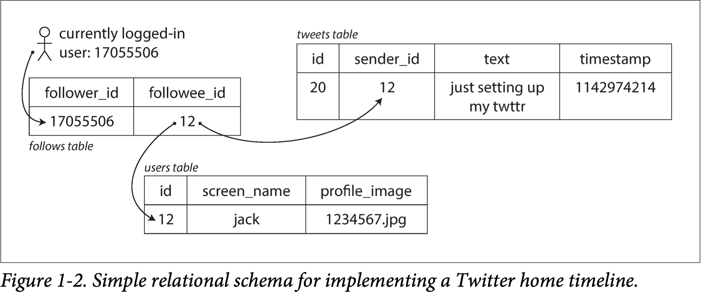
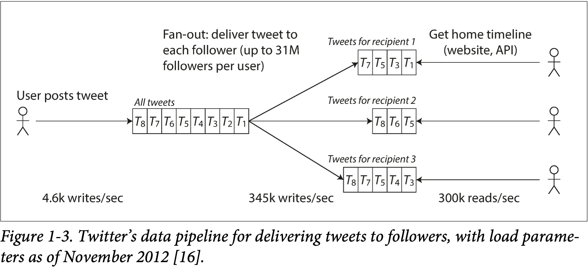

# Chapter 1

## Three concerns that are important in most software systems:

- Reliability
  - The system should continue to work *correctly* (performing the correct function at the desired level of performance) even in the face of *adversity* (hardware or software faults, and even human error). 
- Scalability
  - As the system *grows* (in data volume, traffic volume, or complexity), there should be reasonable ways of dealing with that growth.
- Maintainability
  - Over time, many different people will work on the system (engineering and operations, both maintaining current behavior and adapting the system to new use cases), and they should all be able to work on it *productively*.


## Reliability

Reliability means the system continues to work correctly, even when things go wrong. 

- The application performs the function that the user expected.
- It can tolerate the user making mistakes or using the software in unexpected ways.
- Its performance is good enough for the required use case, under the expected load and data volume.
- The system prevents any unauthorized access and abuse.

#### Hardware Faults

Our first response is usually to add redundancy to the individual hardware components in order to reduce the failure rate of the system. Disks may be set up in a RAID configuration, servers may have dual power supplies and hot-swappable CPUs, and datacenters may have batteries and diesel generators for backup power. When one component dies, the redundant component can take its place while the broken component is replaced. This approach cannot completely prevent hardware problems from causing failures, but it is well understood and can often keep a machine running uninterrupted for years.

#### Software Errors

Such faults are harder to anticipate, and because they are correlated across nodes, they tend to cause many more system failures than uncorrelated hardware faults. 

#### Human Errors


## Scalability

*Scalability* is the term we use to describe a system’s ability to cope with increased load. Note, however, that it is not a one-dimensional label that we can attach to a system: it is meaningless to say “X is scalable” or “Y doesn’t scale.” Rather, discussing scalability means considering questions like “If the system grows in a particular way, what are our options for coping with the growth?” and “How can we add computing resources to handle the additional load?”

#### Describing Load

Let’s consider Twitter as an example. Two of Twitter’s main operations are:

- Post tweet
- Home timeline

There are broadly 2 ways we can handle this:

1. Posting a tweet simply inserts the new tweet into a global collection of tweets. When a user requests their home timeline, look up all the people they follow, find all the tweets for each of those users, and merge them (sorted by time). In a relational database, you could write a query such as:

   ```sql
   SELECT tweets.*, users.* 
   FROM tweets
   JOIN users ON tweets.sender_id = users.id 
   JOIN follows ON follows.followee_id = users.id 
   WHERE follows.follower_id = current_user
   ```

   

2. Maintain a cache for each user’s home timeline—like a mailbox of tweets for each recipient user (see Figure 1-3). When a user *posts a tweet*, look up all the people who follow that user, and insert the new tweet into each of their home timeline caches. The request to read the home timeline is then cheap, because its result has been computed ahead of time.

   


The first version of Twitter used approach 1, but the systems struggled to keep up with the load of home timeline queries, so the company switched to approach 2. This works better because the average rate of published tweets is almost two orders of magnitude lower than the rate of home timeline reads, and so in this case it’s preferable to do more work at write time and less at read time.

However, the downside of approach 2 is that posting a tweet now requires a lot of extra work. On average, a tweet is delivered to about 75 followers, so 4.6k tweets per second become 345k writes per second to the home timeline caches. But this average hides the fact that the number of followers per user varies wildly, and some users have over 30 million followers. This means that a single tweet may result in over 30 million writes to home timelines! Doing this in a timely manner—Twitter tries to deliver tweets to followers within five seconds—is a significant challenge.

###### Solution:

The final twist of the Twitter anecdote: now that approach 2 is robustly implemented, Twitter is moving to a hybrid of both approaches. Most users’ tweets continue to be fanned out to home timelines at the time when they are posted, but a small number of users with a very large number of followers (i.e., celebrities) are excepted from this fan-out. Tweets from any celebrities that a user may follow are fetched separately and merged with that user’s home timeline when it is read, like in approach 1. This hybrid approach is able to deliver consistently good performance. 

#### Approaches for Coping with Load

how do we maintain good performance even when our load parameters increase by some amount?

People often talk of a dichotomy between *scaling up* (*vertical scaling*, moving to a more powerful machine) and *scaling out* (*horizontal scaling*, distributing the load across multiple smaller machines). Distributing load across multiple machines is also known as a *shared-nothing* architecture. A system that can run on a single machine is often simpler, but high-end machines can become very expensive, so very intensive workloads often can’t avoid scaling out. In reality, good architectures usually involve a pragmatic mixture of approaches: for example, using several fairly powerful machines can still be simpler and cheaper than a large number of small virtual machines.


## Maintainability

- Operability
- Simplicity
- Evolvability